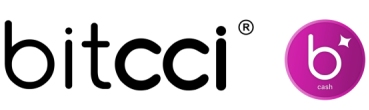

# bitcci cash
This repository contains the solidity smart contract code for the **bitcci cash** ERC20 token. 

The **bitcci cash** token is a payment token, which can be used as a currency to pay for products and services inside the bitcci ecosystem. 

**bitcci cash** is a part of the **bitcci Pay**, which is a new, secure and compliant payment solution for the sex industry. Every product or service, which have been developed by bitcci can be payd via bitcci cash. For entry to clubs and events, purchasing digital content, live communication, ad placements, premium services, licenses and much more. 

## About bitcci: 
bitcci has united the sex industry with the new blockchain world.
The **bitcci Group AG** is made up of a group of public stock companies located in the cryptovalley of Lichtenstein and Switzerland. Founded by **Christoph Elbert** in 2017, the **bitcci Group AG** is building an entirely new global ecosystem for the next-generation sex industry,  eliminating problems and making the industry legal, safe and free.
The **bitcci AG**, a 100% subsidiary of the bitcci Group AG, located in Zug, Switzerland, has developed the bitcci cash token and executes the token emission in 2021.

learn more about bitcci Cash Smart Contracts :

[Smart Contract Specifications](docs/SPECS.md) \
[Development](docs/DEVELOPMENT.md) \
[Surya Static Analysis Graphs](docs/images/)
